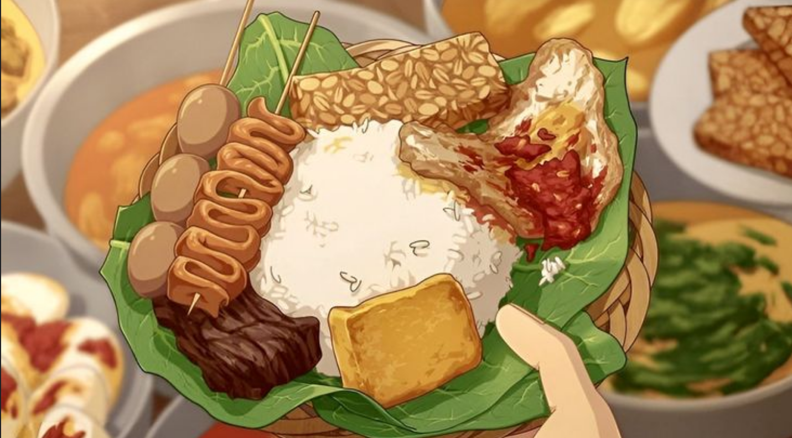
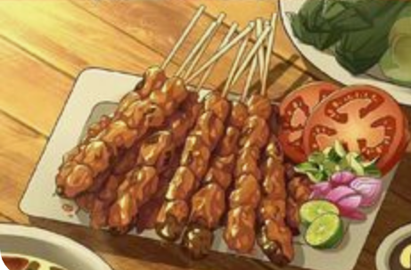
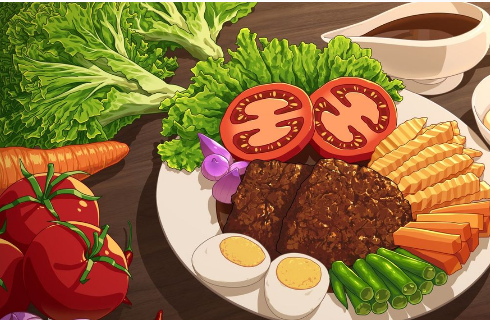
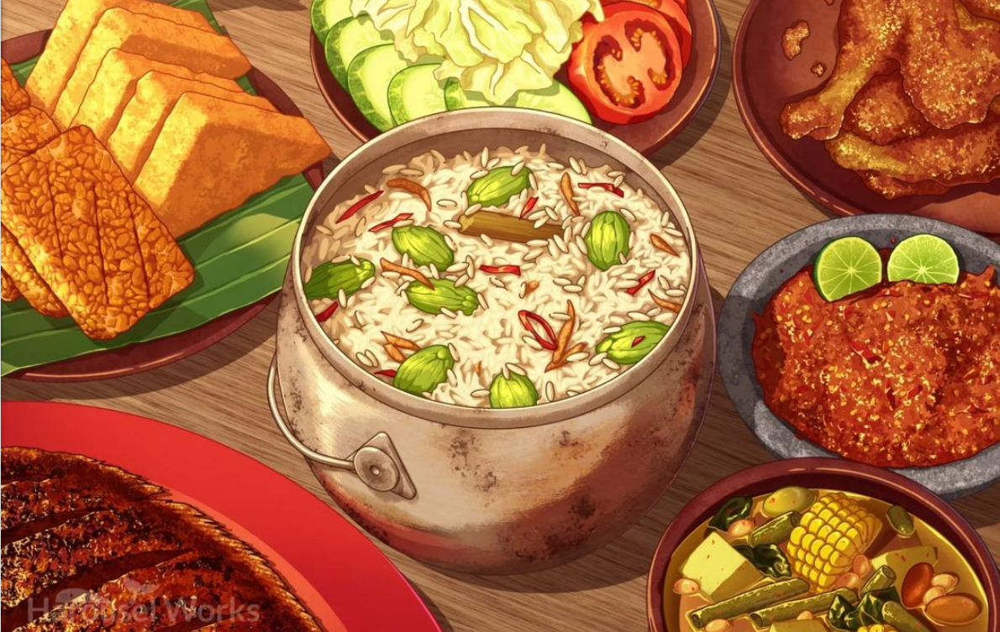
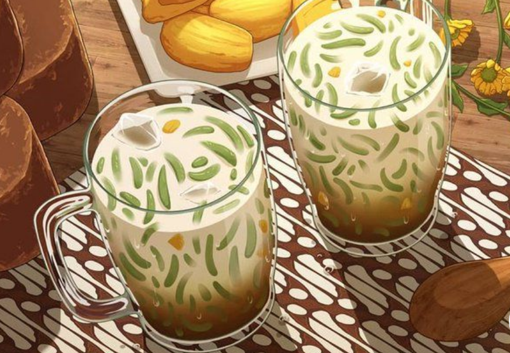
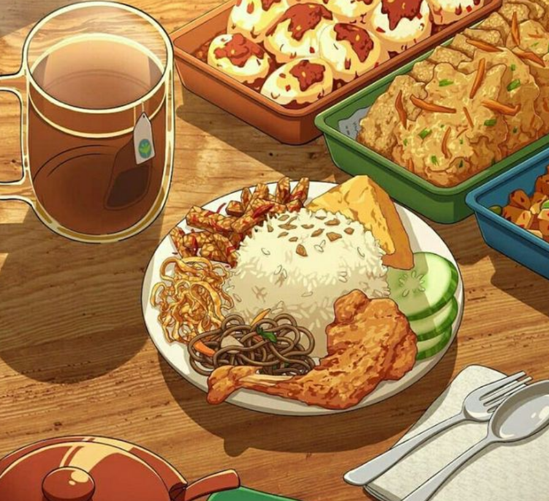
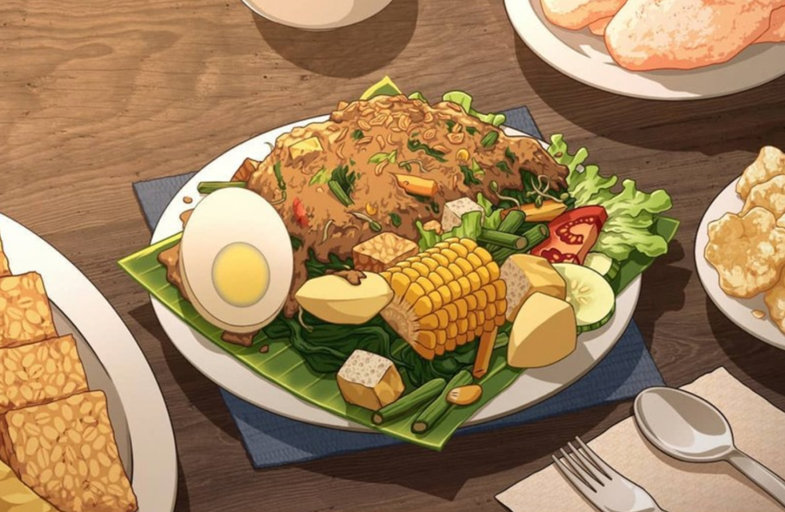

# Welcome to Indonesian Food Delights!!

Welcome to Indonesian Food Delights, where we celebrate the rich and diverse flavors of Indonesian cuisine! Our website showcases a variety of traditional dishes that bring a touch of nostalgia and warmth to your dining experience. From the bustling streets of Jakarta to the serene countryside of Bali, we bring you authentic Indonesian meals that are sure to transport you back to your childhood.

## Our Featured Dishes

### Nasi Pedang
Experience the unique taste of Nasi Pedang, a delectable Padang rice dish topped with spicy rendang beef and a variety of savory side dishes. This iconic meal is a true representation of Indonesian flavors, offering a comforting and hearty taste that feels like a warm hug from home.

    𝐒𝐚𝐭𝐚𝐲 𝐁𝐚𝐛𝐢

Savor the succulent and flavorful Satay Babi, skewered and grilled pork marinated in a rich blend of spices. Each bite is a delightful combination of sweet, savory, and smoky flavors, reminiscent of traditional Indonesian street food enjoyed with family and friends.

   𝐒𝐞𝐥𝐚𝐭 𝐒𝐨𝐥𝐨
   
Indulge in Selat Solo, a special Javanese beef stew with a tangy and savory sauce. This dish is a nostalgic reminder of Indonesian family gatherings, where the rich flavors and aromatic spices bring people together for a heartwarming meal.

𝐀𝐧𝐝 𝐒𝐨 𝐌𝐮𝐜𝐡 𝐌𝐨𝐫𝐞!

Explore our extensive menu to discover other beloved Indonesian dishes that will awaken your taste buds and remind you of cherished memories. Whether it's the vibrant flavors of Gado-Gado or the comforting taste of Soto Ayam, our dishes offer a taste of Indonesia's culinary heritage.

Nasi Lewit

Cendol !!! 
 

## Heartwarming Memories

Indonesian food is not just about taste—it's about the memories and emotions that come with every meal. Each dish tells a story and evokes fond memories of family gatherings, festive celebrations, and simple pleasures. Our website is dedicated to bringing those heartwarming experiences to you, so you can enjoy the essence of Indonesian culture and cuisine from the comfort of your home.

Nasi Uduk

Rendang

